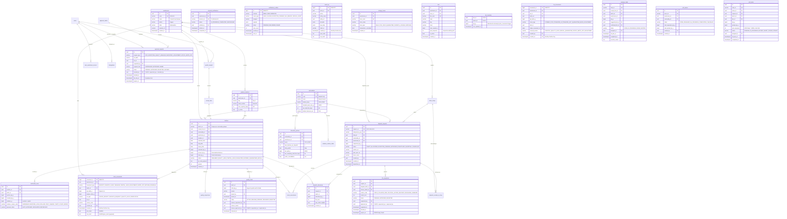

# BhandarSetu (भंडार सेतु) — Entity Relationship Diagram (ERD)

```mermaid
erDiagram
    warehouses ||--o{ godown_locations : "contains"
    warehouses ||--o{ ration_shops : "supplies"
    warehouses ||--o{ goods_receipts : "receives_at"
    warehouses ||--o{ batches : "stores"
    warehouses ||--o{ dispatch_requests : "dispatches_from"
    warehouses ||--o{ stock_movements : "logs"

    commodities ||--o{ allocation_policies : "governed_by"
    commodities ||--o{ batches : "categorizes"
    commodities ||--o{ dispatch_requests : "demanded_in"
    commodities ||--o{ variance_reason_codes : "tolerates"

    users ||--o{ user_warehouse_access : "assigned"
    users ||--o{ delegations : "delegates_to"
    users ||--o{ approval_requests : "requests_or_decides"
    users ||--o{ goods_receipts : "receives"

    goods_receipts ||--|{ receipt_lines : "contains"
    receipt_lines ||--|| batches : "originates"
    godown_locations ||--o{ batches : "stacks"

    batches ||--o{ dispatch_allocations : "allocated_to"
    batches ||--o{ stock_movements : "ledgered_in"
    batches ||--o{ quality_holds : "subjected_to"
    batches ||--o{ quality_inspections : "tested_in"
    batches ||--o{ stock_reservations : "reserved_in"
    batches ||--o{ verification_lines : "counted_in"

    ration_shops ||--o{ dispatch_requests : "orders"
    ration_shops ||--o{ dispatch_receipts_at_shop : "acknowledges"

    dispatch_requests ||--o{ dispatch_allocations : "composed_of"
    dispatch_requests ||--o{ fifo_exceptions : "governs"
    dispatch_requests ||--o{ stock_reservations : "reserves"
    dispatch_requests ||--o{ dispatch_receipts_at_shop : "delivered_to"

    approval_matrix ||--o{ approval_requests : "evaluates"

    warehouses {
        uuid id PK
        varchar code UK "GDN-001"
        varchar name "Central Food Godown"
        varchar district "Nagpur"
        varchar state "Maharashtra"
        numeric capacity_mt
        timestamptz created_at
    }

    godown_locations {
        uuid id PK
        uuid warehouse_id FK
        varchar bay "Bay-A"
        varchar stack_number "Stack-04"
        int max_capacity_bags "500"
        bool is_active
    }

    commodities {
        uuid id PK
        varchar code UK "WHEAT-FAQ"
        varchar name "Wheat Grade A"
        varchar default_policy "FIFO | FEFO"
        int standard_pack_size_g "50000"
        int min_shelf_life_days "90"
        numeric default_tolerance_pct "0.50"
    }

    allocation_policies {
        uuid id PK
        uuid commodity_id FK
        uuid warehouse_id FK
        varchar mode "FIFO | FEFO"
        int max_batches_per_dispatch "4"
        bool allow_partial "false"
        bigint min_split_g "50000"
        int min_remaining_shelf_life_days "30"
        bool prefer_consolidation "true"
    }

    batches {
        uuid id PK
        varchar batch_no UK "Unique per commodity+godown"
        uuid receipt_line_id FK
        uuid commodity_id FK
        uuid warehouse_id FK
        uuid location_id FK
        date received_date
        date mfg_date
        date expiry_date
        bigint received_qty_g
        bigint current_qty_g "Denormalized balance"
        bigint held_qty_g "Partial hold balance"
        varchar status "AVAILABLE | QUALITY_HOLD | PARTIAL_HOLD | EXHAUSTED | EXPIRED | QUARANTINED_RECALL"
        text qr_code_payload
        int version
        timestamptz created_at
    }

    stock_movements {
        bigint movement_id PK "IDENTITY"
        uuid warehouse_id FK
        varchar movement_type "RECEIPT | DISPATCH | HOLD | RELEASE | PARTIAL_HOLD | ADJUSTMENT | WRITE_OFF | RETURN | REVERSAL"
        uuid batch_id FK
        bigint qty_delta_g "Signed (+/-)"
        bigint balance_after_g
        varchar ref_type "GOODS_RECEIPT | DISPATCH_REQUEST | QUALITY_HOLD | VERIFICATION"
        uuid ref_id
        varchar reason_code
        uuid created_by FK
        timestamptz created_at "Monthly Partition Key"
        text prev_hash "SHA256"
        text row_hash "SHA256(prev_hash || payload)"
    }

    dispatch_requests {
        uuid id PK
        varchar request_no UK "DSP-2026-0001"
        varchar idempotency_key UK
        uuid shop_id FK
        uuid commodity_id FK
        uuid warehouse_id FK
        bigint requested_qty_g
        varchar status "DRAFT | ALLOCATED | EXCEPTION_PENDING | APPROVED | DISPATCHED | SHORTFALL | CANCELLED"
        varchar vehicle_no
        varchar gate_pass_no
        varchar driver_name
        uuid created_by FK
        timestamptz created_at
        timestamptz dispatched_at
    }

    dispatch_allocations {
        uuid id PK
        uuid request_id FK
        uuid batch_id FK
        bigint allocated_qty_g
        int fifo_rank
        bool was_oldest_eligible
        timestamptz created_at
    }

    quality_holds {
        uuid id PK
        uuid batch_id FK
        bigint held_qty_g "Supports partial and full holds"
        varchar reason
        uuid placed_by FK
        timestamptz placed_at
        varchar status "ACTIVE | RELEASE_PENDING | RELEASED | REJECTED"
        uuid release_requested_by FK
        text release_reason
        uuid release_approved_by FK "CHECK: requested_by <> approved_by"
        timestamptz released_at
    }

    fifo_exceptions {
        uuid id PK
        uuid request_id FK
        uuid skipped_batch_id FK
        uuid chosen_batch_id FK
        varchar reason_code "STACK_COLLAPSE_RISK | PHYSICAL_ACCESS_BLOCKED | PACKAGING_DAMAGED"
        text reason_text
        varchar status "PENDING | APPROVED | REJECTED"
        uuid requested_by FK
        uuid approved_by FK "CHECK: requested_by <> approved_by"
        timestamptz requested_at
        timestamptz decided_at
        timestamptz expires_at "BS005 Expiry Guard"
    }

    approval_requests {
        uuid id PK
        varchar request_type "FIFO_EXCEPTION | QUALITY_RELEASE | INVENTORY_ADJUSTMENT | STOCK_WRITE_OFF"
        varchar ref_table
        uuid ref_id
        uuid requested_by FK
        varchar required_role "SUPERVISOR | APPROVER | ADMIN"
        varchar status "PENDING | APPROVED | REJECTED | EXPIRED"
        uuid decided_by FK "CHECK: requested_by <> decided_by"
        timestamptz decided_at
        timestamptz sla_due_at "Escalation SLA"
        timestamptz expires_at
    }

    physical_verifications {
        uuid id PK
        uuid warehouse_id FK
        varchar session_no UK "PV-2026-Q1-01"
        varchar status "IN_PROGRESS | COMPLETED | RECONCILED"
        uuid verified_by FK
        timestamptz started_at
        timestamptz completed_at
    }

    verification_lines {
        uuid id PK
        uuid session_id FK
        uuid batch_id FK
        bigint system_qty_g
        bigint counted_qty_g
        bigint variance_g "counted - system"
        varchar variance_reason_code "SHRINKAGE | MOISTURE_LOSS | SPILLAGE | PEST_DAMAGE | THEFT | COUNT_ERROR"
        varchar approval_status "AUTO_APPROVED | ESCALATED | RECONCILED"
    }

    notifications_outbox {
        bigint id PK "IDENTITY"
        varchar channel "EMAIL | SMS | WEBHOOK"
        varchar event_type "HOLD_PLACED | EXCEPTION_PENDING | SLA_BREACH | RECALL_ALERT"
        varchar recipient
        jsonb payload
        varchar status "PENDING | DELIVERED | FAILED"
        int retry_count
        timestamptz created_at
        timestamptz sent_at
    }

    audit_log {
        bigint id PK "IDENTITY"
        uuid actor_id FK
        varchar action
        varchar entity_name
        uuid entity_id
        jsonb old_data
        jsonb new_data
        varchar client_ip
        timestamptz created_at "Monthly Partition Key"
        text prev_hash
        text row_hash
    }

    storage_zones {
        uuid id PK
        uuid warehouse_id FK
        varchar zone_code UK
        varchar zone_name
        varchar zone_type "BULK | PICK_FACE | QUARANTINE | DISPATCH_STAGING | RETURNS"
        bool temperature_controlled
        timestamptz created_at
    }

    bins {
        uuid id PK
        uuid warehouse_id FK
        uuid zone_id FK
        varchar bin_code UK
        varchar rack
        varchar bay
        varchar level
        bigint max_capacity_g
        int pick_sequence "Serpentine walking path"
        bool is_active
        timestamptz created_at
    }

    bin_inventory {
        uuid bin_id PK, FK
        uuid batch_id PK, FK
        bigint qty_g "Maintained exclusively by bin_movements trigger"
        timestamptz last_updated_at
    }

    bin_movements {
        bigint movement_id PK "IDENTITY"
        uuid warehouse_id FK
        uuid bin_id FK
        uuid batch_id FK
        bigint qty_delta_g
        varchar move_type "PUTAWAY | PICK | TRANSFER_IN | TRANSFER_OUT | QUARANTINE_MOVE | ADJUSTMENT"
        uuid task_id
        bigint ledger_movement_id FK
        varchar removal_reason "DISPATCH | QUALITY_HOLD | RECALL_QUARANTINE | EXPIRY_WRITE_OFF | ADJUSTMENT"
        uuid created_by FK
        timestamptz created_at PK "Monthly Partition Key"
    }

    putaway_tasks {
        uuid id PK
        varchar task_no UK
        uuid receipt_line_id FK
        uuid batch_id FK
        uuid warehouse_id FK
        bigint qty_g
        uuid suggested_bin_id FK
        uuid confirmed_bin_id FK
        varchar status "OPEN | IN_PROGRESS | DONE | SKIPPED"
        uuid assigned_to FK
        timestamptz sla_due_at
        timestamptz completed_at
        text override_reason
    }

    pick_waves {
        uuid id PK
        varchar wave_no UK
        uuid warehouse_id FK
        uuid commodity_id FK
        varchar status "OPEN | RELEASED | IN_PROGRESS | COMPLETED | CANCELLED"
        bigint total_requested_qty_g
        bigint total_picked_qty_g
        uuid created_by FK
        timestamptz created_at
    }

    pick_tasks {
        uuid id PK
        varchar task_no UK
        uuid wave_id FK
        uuid request_id FK
        uuid batch_id FK
        uuid bin_id FK
        bigint qty_g
        bigint picked_qty_g
        int pick_sequence "(FIFO Rank * 10000) + Bin Path"
        varchar status "PENDING | IN_PROGRESS | PICKED | SHORT_PICKED | STAGED"
        uuid assigned_to FK
        timestamptz sla_due_at
        timestamptz completed_at
    }
```
